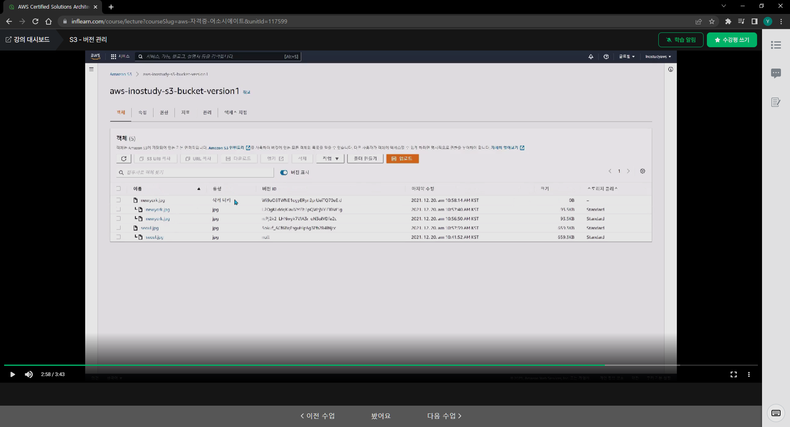
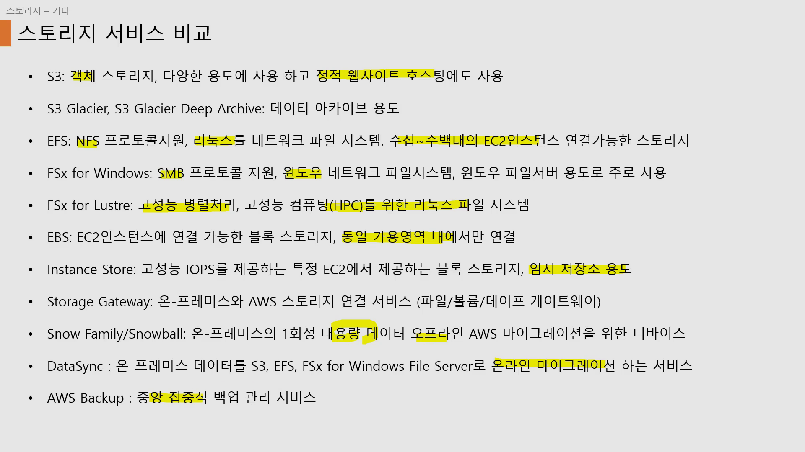

# AWS 강의

## IAM

JSON 형식으로 작성. 작성되지 않은 내용은 모두 차단된다. 

### IAM 정책

#### 권한 경계

IAM 사용자 또는 역할에 최대 권한을 제한. 

### IAM 역할

AWS리소스에서 사용하는 자격증명. 정책을 연결해서 IAM역할에 작업 수행에 필요한 권한을 부여

#### 신뢰정책

>  IAM 역할을 사용하여 AWS 계정간 접근 권한 위임을 하는 기능. 

특정 AWS 서비스가 다른 AWS 서비스에 접근할 때 사용하는 기능. 예를 들면, 개발서버와 운영서버가 있을 때, 일시적으로 운영서버에 대한 코드 푸시 권한을 개발 계정을 가진 사용자에게 부여해야 한다고 하자. 이 때 사용할 수 있는 솔루션은 운영계정에 IAM역할을 생성한 다음, 개발 계정에 신뢰정책을 정의하면 된다.

#### IAM 역할 예제

IAM > 역할 > 필요한 서비스 선택

EC2에서 실행되는 앱이 RDS, S3와 같은 다른 서비스에 접근하려고 할 때 EC2에 정책을 추가한 IAM 권한을 주면 된다.

##### EC2에 IAM 추가 방법

인스턴스 생성 시, 고급 프로파일에 들어가서 IAM 인스턴스 프로파일에 생성한 IAM 역할을 추가해주면 된다.


### IAM 보안 도구

##### IAM 자격증명 보고서

생성된 계정과 관련한 패스워드, 엑세스 키 등의 정보를 볼 수 있다.

##### IAM 엑세스 관리자

서비스 별로 어떤 접근 권한을 가지고 있는지 알 수 있다.


#### IAM 정책 시뮬레이터

> AWS 계정의 IAM 사용자, 사용자 그룹 또는 역할에 연결된 정책을 테스트

어떤 IAM A(계정, 역할, RULE-정책)가 B action 권한을 가지고 있는지 확인 가능하다. 예를 들면 A 계정이 이미지 생성 action을 할 수 있는지와 같은 확인을 할 수 있다. 


## EC2

>  클라우드 컴퓨팅 서비스.

리소스. 인스턴스, 로드밸런서, 배치그룹 등이 있다. 태그를 추가할 수 있다. 애플리케이션 이미지가 있다. 인스턴스 유형을 선택할 수 있다. 키페어로 원격접속 시 사용가능한 키 파일 등을 생성할 수 있다. 네트워크 설정을 할 수 있다. 보안 그룹을 선택할 수 있다. 보안 그룹을 통해 접근 규칙 등을 선택할 수 있다. 스토리지 구성을 이용해 가상 컴퓨터가 사용할 스토리지를 선택할 수 있다. 공유파일을 위한 파일 시스템도 선택할 수 있다.

- 사용자 데이터

인스턴스를 실행할 때, 여기에 스크립트가 있으면 해당 스크립트를 실행함.

### 연결방식

#### 1. SSH

키 파일을 이용해 커맨드 프롬프트를 이용해 접근이 가능하다. 22번 포트로 접속하기 때문에 22번 포트 방화벽 오픈이 필요하다.

키파일이 너무 많은 로컬 사용자에게 오픈되어 있는 경우 접근이 차단될 수 있다.

=> 파일 속성에 상속사용안함 선택하고 현재사용자만 추가해주자.

#### 2. RDP (Windows only)

원도우즈 OS의 RDP 프로토콜을 이용한다. 접속할 때 암호는 EC2 콘솔에서 키파일을 이용해 암호를 생성할 수 있다.

인스턴스 > 인스턴스 ID선택 > 인스턴스에 연결 선택 >

\> RDP 클라이언트 > 암호가져오기 선택해서 키파일 데이터 업로드하면 암호화 키 생성할 수 있음.

#### 3. Instance Connect

리눅스만 가능. Ec2 `연결` 선택하면 된다. 

원격 연결 불가시 리눅스 > 보안 > 22번 포트 오픈인지 확인

### 인스턴스 유형

인스턴스 유형에 따라 컴퓨터 하드웨어가 결정. CPU, 메모리, 스토리지, 네트워크 용량의 여러 조합으로 구성. 컴퓨터 스펙을 선택한다고 보면 된다. 

### 네트워크 인터페이스

`ENI` 가상 네트웨크 인터페이스. 인스턴스에 가상 IP, MAC 주소를 준다. 

인스턴스 > 네트워킹 tab. 보안그룹관 연결이 됨. 서브넷은 인스턴스와 동일한 가용영역에 있어여 함. 하나의 인스턴스에 2개 이상의 네트워크 인터페이스를 줄 수 있다.

### 보안그룹

EC2 인스턴스에 대한 인바운드 아웃바운드 트래픽을 제어하는 가상 방화벽 역할을 한다. 인스턴스의 네트워크 인터페이스와 연결됨. `상태저장 방화벽`이다. 허용 규칙만 지정 가능하고 거부 규칙은 지정할 수 없음. 

#### 상태저장 방화벽

아웃바운드 규칙 상관 없이 허용된 인바운드 트래픽에 대한 반응으로 외부로 나가는 흐름이 수행. 내가 이해한 바로는 정당한 인바운드 요청에 대해 아웃바운드 트래픽(예_http 응답)은 허용된다. 마찬가지로 아웃바운드 요청이 EC2에서 먼저 발생했다면 그에 맞는 응답은 인바운드 요청 관계없이 허용된다. 

### 탄력적 IP

인스턴스를 생성할 때 할당받은 public IP는 인스턴스를 재시작하면 다른 IP로 할당 받아 주소가 변경된다. Elastic IP를 할당 받으면 인스턴스를 다시 시작해도 고정 IP를 받아서 쓸 수 있다. 탄력적 IP는 유료 서비스이다.

### AMI

> 아마존 머신 이미지. 

3가지 종류가 있다. 아마존에서 제공하는 기본 이미지, 마켓플레이스, 사용자 커스텀 AMI가 있다. elastic block store에서 스냅샷을 만들어서 내가 만들어둔 이미지를 저장할 수 있다.  

### 배치그룹

인스턴스를 물리적으로 어디에 배치할지. 

#### 클러스터 배치그룹

인접한 물리적 서버끼리 배치해서 네트워크 지연시간이 매우 짧아서(**고속 네트워크 연결**) 고성능 컴퓨팅에 적합하다.

#### 파티션 배치그룹

하드웨어를 파티션을 그룹화. 파티션끼리는 서로 다른 하드웨어 사용. 하드웨어를 공유하지 않기 때문에 하나의 하드웨어 장애 발생 시 다른 하드웨어에 영향 없음.  하둡 등의 빅데이터 분산처리 시스템에 활용. 

#### 분산형 배치 그룹

같은 서버랙의 서버를 그룹화. 서버랙 단위로 장애가 발생했을 때 영향도 없음. 매우 중요하고 고가용성이 필요한 애플리케이션에 적합.

### EC2 라이프 사이클

시작: 인스턴스 전원을 켜는 것

재부팅 : 인스턴스 재부팅

중지 : 인스턴스 전월을 끄는 것

종료 : 인스턴스 삭제

`최대절전모드` : RAM에 있는 애플리케이션 상태를 저장 후 중지상태 전환 노트북에서 종료를 안하고 스크린만 닫을 때와 동일. 서버 부팅 시 프로세스 로드시간이 오래걸리는 시스템의 경우 유용.


## Elastic Load Balancing

### 확장성

- 수직적 확장 : 자원을 추가하는 방식 (사양 업그레이드)

- 수평적 확장 :  노드를 추가하는 방식. EC2 인스턴스 개수를 늘리는 것.

고가용성 : 이중화를 통해 가용영역 하나에 장애가 발생해도 가용성 유지 가능

### 로드밸런서 종류

애플리케이션, 네트워크, 게이트웨이 로드밸런서

#### 애플리케이션 

7계층에서 사용

#### 네트워크 

4계층에서 사용. TCP, UDP 프로토콜. 대용량, 게이밍과 같은 데이터를 처리할 때 사용

#### 게이트웨이

 보안검사를 위한 용도로 사용


### 구성 (게이트웨이 제외)

생성방법은 

1. 로드밸런싱 > 대상그룹을 선택하면 생성할 수 있다.
2. 로드밸런서를 생성하여 등록해주면 로드밸런서를 사용할 수 있다.  

#### 1. 리스너 

client, 타켓그룹 사이 연결을 위해 프로토콜, 포트번호로 구성. 

#### 2. 타켓그룹

타켓은 EC2, 오토 스케일링 그룹, IP주소, 람다, 앱 로드밸런서 등등이 있다. `개별 인스턴스`, `인스턴스 여러개(오토스케일링)`, `IP 주소`, `람다`, `다른 앱 로드밸런서` 등등이 있음.

앱 로드밸런서는 웹 트래픽을 다루기 때문에 http, https 프로토콜, 네트워크는 TCP, TLS, UDP 등을 사용한다. 게이트웨이는 `제네브` 프로토콜 사용

##### 상태검사 

대상의 상태 확인


#### 3. 타켓그룹 종류

##### 인스턴스

EC2 오토 스케일링

##### IP 주소

로컬 VPC CIDR

public IP 주소

##### 람다

##### 앱 로드 밸런서


#### 타켓그룹 속성

1. 등록취소지연 : 요청이 없어서 deregisteration된 인스턴스에 더 이상의 요청을 보내지 않는 기능
2. slow start duration : 보내는 요청 수를 선형으로 증가시킴
3. 알고리즘 : 라운드 로빈 (일정 시간 라우팅 변경), 최소 미해결 요청(처리하고 있는 요청이 가장 작은 대상에 라우팅)
4. 고정 : 클라이언트가 로드밸런서를 통해 특정 대상에 연결되었을 때 해당 클라이언트는 해당 대상에 계속 요청을 하도록 고정. 세션과 쿠키를 이용해 구현
5. 등록해제시 연결종료 : 등록취소 지연에 도달했을 때 네트워크 로드밸런서가 활성 연결 종료


### ALB

리스너 규칙

- host header : 호스트 이름을 기반으로 라우팅
- path : URL 경로에 패턴 기반
- http header : 요청의 http 헤더기반
- http request method : 요청 메소드 기반 라우팅
- query string : 쿼리 문자열 키-value 페어
- source IP : 각 요청의 소스 IP주소 기반 라우팅

각 규칙을 타겟그룹을 연결해주면 된다.

** HTTPS는 ACM 서비스를 이용해 인증서를 발급 받고 적용을 하고나면 사용할 수 있다.


### NLB

TCP, UDP, TLS 요청을 로드밸런싱해야 하는 경우 사용. 고정 IP 주소할당 가능. 클라이언트 IP주소를 전달할 수 있다. 리스너 규칙설정이 없음. 수백만 대용량 처리에 적합

프로토콜 : TCP, TCP/UDP, TLS 사용

데이터 전송보안을 위해 SSL/TLS 인증서를 배포해야 하고 인증서는 ACM 또는 클라이언트 인증서를 사용해야 한다.


## EC2 Auto Scaling

원하는 용량, 최소용량, 최대용량을 설정할 수 있다. 구성요소로 오토스케일링 그룹, 시작 템플릿(AMI), 조정옵션(오토스케일링을 실행하기 위한 조건) 등이 있다. 

### 조정정책

수동조정, 일정기반 조정, 온디맨드 기반 조정, 예측 조정 사용(머신러닝, cloud watch) 등의 정책이 있음. `항상 현재 인스턴스 수준 유지 관리`정책은 지정된 갯수의 실행인스턴스를 유지하도록 하는 정책

#### 동적 조정

대상 추척 조정 : 지정한 지표에 도달하면 그룹 확장 (CPU, 바이트 수 등등)

단계 조정 : 클라우드 워치 기반. 크기조정 활동이 진행되는 기간에도 경보에 응답.

단순 조정 : 클라우드 워치 기반. 크기조정 활동이 진행되는 기간에는 경보에 응답 안함

아마존 SQS 기반 크기 조정 : 대기열의 시스템 로드 변경에 따라 오토 스케일링 그룹 조정

#### 조정 쿨다운

증가/감소하는 활동이 발생하면 쿨다운 기간을 가짐. 부팅하는 동안에는 CPU사용량이 증가할 수 밖에 없기 때문.

#### 수명주기 후크

이벤트를 인식한 다음 해당수명주기 이벤트가 발생할 때 사용자 지정 작업을 수행

인스턴스가 `인서비스 상태 가기전`, `터미네이티드` 상태에 가지전 특정 작업을 수행하도록 함. 예를 들면 로깅. 백업 등등 


### 실습

1. 인스턴스 > 시작 템플릿

시작 템플릿을 만들 수 있음.

2. auto scaling > auto scaling 그룹 생성

#### CPU 부하 테스트 방법

```bash
$ sudo amazon-linux-extras install epel -y
$ sudo yum install stress -y
$ stress -c 10 
# cpu 10개를 할당
```

 

## EC2 스토리지

Elastic Block Storage

EC2에 연결하여 사용하는 블록 스토리지. EC2 인스턴스 시작 시 AMI가 설치되는 EBS 루트 볼륨이 생성됨. 여러개의 EBS 볼륨을 생성하여 EC2에 추가 연결 가능. EBS와 EC2는 동일한 가용영역에 있어야 연결 가능. 스냡샷 기능을 통해 EBS 볼륨 백업 가능. 수명 주기 관리자 정책을 통해 스냅샷 생성 일정을 자동화 가능. AWS 키 매니처 서비스(KMS)를 이용해 EBS 볼륨 암호화 가능. `SSD`, `HDD` 타입이 있음.

### 유형

SSD  > 프로비져닝 된 IOPS : 고성능 처리 64000 ~ 256000 IOPS

SSD > 범용 SSD : 일반용도 16000 IOPS

HDD > 처리량 최적화 : 500 IOPS

HDD > 콜드 HDD : 250 IOPS


### 다중 연결

하나의 EBS 볼륨을 여러개의 EC2에 연결. Nitro 기반의 리눅스 인스턴스만 연결 가능. 동시에 최대 16대의 EC2 인스턴스 연결 가능. 동시 쓰기 작업이 필요한 클러스터링 된 리눅스 앱에 사용

### 스냅샷

• EBS 볼륨의 데이터를 백업 하는 기능
• 백업된 스냅샷을 다른 가용영역 또는 리전에 복사 가능
• 스냅샷을 커스텀 AMI 이미지로 만들 수 있음
• 백업된 스냅샷을 가지고 새로운 EC2 인스턴스를 생성 가능
• EBS 스냅샷 아카이브 (EBS Snapshot Archive)
✓ 자주 액세스 하지 않는 스냅샷을 저렴한 아카이브 스토리지 계층에 보관
✓ 90일 이상 저장할 계획이고 액세스할 필요가 거의 없는 스냅샷에 대해 최대 75% 비용이 저렴(최소 과금 기간
90일)
• EBS 스냅샷 휴지통 (Recycle Bin for EBS Snapshot)
✓ 실수로 삭제한 스냅샷을 휴지통에 보관해서 복구 가능
✓ 삭제된 파일을 1일 부터 365일까지 보관 설정 가능
• EBS 빠른 스냅샷 복원 (EBS Fast Snapshot Restore-FSR)
✓ 지연시간을 최소화 하여 빠르게 스냅샷으로부터 EBS 볼륨을 복원하는 기능


### 암호화

1. EBS 볼륨 스냅샷을 생성
2. EBS 볼륨 스냅샷을 복사한 후 스냅샷을 암호화 후 암호화된 스냅샷으로부터 새 EBS 볼륨 생성
   또는 암호화 되지 않는 스냅샷에서 새 EBS 볼륨을 생성할 때 암호화 선택
3. 새 EBS볼륨을 EC2인스턴스에 연결


### Instance Store

블록 수준의 임시 스토리지. ec2 서버에 직접 장착이 되어 있는 물리적 SSD. 따라서 인스턴스 중지 또는 최대 절전모드 전환 시 인스턴스 스토어의 모든 스토리지 리셋. 고성능(가장 빠른 성능).중요 장기 데이터는 권장하지 않음. 

#### 실습

인스턴스 유형 중 인스턴스 스토어 사용 가능 유형이 따로 있음. 


### EFS

리눅스 환경에서 EC2 인스턴스에서 연결하기 ㅟ한 네트워크 파일 스토리지.

NFS 프로토콜 사용. 보안그룹을 통해 접근 가능하고 온프레미스 환경에서도 사용 가능.

##### 스토리지 클래스

표준 스토리지 : 3개 가용영역에 자주 엑세스하는 파일 저장에 사용

표준 IA : 3개 가용영역에 자주 사용하지 않는 파일 저장

one zone :  1개 가용영역에 자주 엑세스하는 파일 저장에 사용

one zone IA : 1개 가용영역에 자주 사용하지 않는 파일 저장

##### 성능 모드

읽기 쓰기 속도. 

##### 처리량 모드

#### 실습

1. 보안그룹 생성 > 인바운드 **NFS 프로토콜** 허용
2. EFS 생성
3. EC2 생성
4. EFS 생성을 위해 VPC 생성 필요.
5. EFS > 연결에서 마운트를 한다. 방식은 명령어를 이용하는 방법, IP를 통해 탑재하는 방법 2가지가 있다. 

```bash
$ sudo yum install -y amazon-efs-utils
$ sudo mkdir /mnt/efs
$ cd /mnt/efs
$ sudo mount -t efs -o tls fs-~~~~~~~~:/ efs
$ cd efs
(efs 마운트 명령어.)
```

 

### 참고

1. instance store => 1개의 ec2 인스턴스 유형에 물리적 디스크 연결. 고성능 앱에 사용. ec2 중단되면 리셋되기 때문에 임시용도에 적합

2. EBS => 동일 가용영역에 있는 EC2에 연결 가능 (1EC2 , N개의 EBS)

3. EFS => NFS프로토콜을 사용하는 네트워크 파일 스토리지(리눅스만 사용 가능)

   => **여러 가용 영역에 있는 수백대의 EC2를 하나의 EFS에 연결 가능**(N개의 서버, 1개의 EFS)


## S3

### 데이터 저장방식

#### 오브젝트 스토리지 

> 오브젝트라고 불리는 개별 유닛에 데이터를 저장하는 스토리지 포맷

S3와 같은 서비스가 있음.

#### 블록 스토리지

> 데이터를 고정된 사이즈의 블록으로 나눠 각각 고유한 식별자와 함께 저장

EBS와 같은 서비스

#### 파일 스토리지

> 계층적 파일 디렉터리 내 파일로 저장

EFS 와 같은 서비스. 해당 파일(데이터)에 접근하기 위해 데이터의 경로를 알아야 함.


### S3 개요

버킷 : 오프젝트 저장 공간. 리전단위로 생성, 버킷 이름은 유일해야 함. 최소 3개의 가용영역에 데이터 자동 분산 => 가용성, 성능, 확장성, 내구성이 좋음. 정적 웹사이트 호스팅. 클라우드 스토리지. 아카이브에 사용

버킷을 생성하고 파일을 업로드하면 해당 데이터에 대해 `객체 URL`이 제공된다. 이 객체 URL로 접근을 위해서는 접근 정책을 설정해줘야 한다.

### 버전관리

객체(파일)을 덮어쓰기나 버전관리가 가능하다. MFA를 조합하면 삭제방지도 가능하다. 버전관리 기능 활성화가 필요하다. 




삭제를 하더라도 삭제 마크를 이용해 표시를 할 수 있다. 파일 덮어쓰기 등을 진행할 때 버전관리 기능을 켜두면 버전관리되는 것을 알 수 있다.


#### 객체 암호화

데이터 전송 및 저장 중 암호화 사용 가능. SSE-S3, KMS, SSE-C 방식 등으로 암호화 가능. 


#### 버킷 정책

접근 방식 제어

1. 버킷 정책 (가장 많이 씀)
   1. JSON 형식. 특정 AWS 리소스에서만 S3 버킷에 액세스 허용. 다른 AWS 계정에 버킷엑세스 권한 부여 가능
2. 퍼블릭 액세스 차단
   1. 버킷과 객체에 대한 퍼블릭 액세스 차단, 허용. **정적 페이지 호스팅**에 사용
   2. html 파일 업로드
   3. 정적 웹사이트 호스팅 선택 => URL 생성
   4. 권한 > 퍼블릭엑세스 허용
   5. 버킷정책 수정 > 생성 > 모든 리소스 허용, `GETOBJECT` 
   6. 생성된 정책 버킷정책에 추가.
3. ACL 엑세스 제어 목록


### CORS

웹 사이트 -> 버킷1, 버킷1 -> 버킷2

버킷 1에서 CORS 헤더를 붙여서 응답해줘야 클라이언트에서 버킷2에 리소스 요청할 때 데이터를 정상적으로 읽어올 수 있음.


### 로깅

버킷과 로그파일과 같은 버킷에 있으면 로그가 무한히 생성된다. 그러니까 다른 버킷에 생성해야 한다. 

속성 > 서버 엑세스 로깅 활성화 > 대상 버킷 선택

### 복제기능

`교차 리전`과 `동일 리전` 복제 두가지가 있음. 교차리전은 국제 서비스 또는 재해 복구를 위해 사용. 동일리전은 법적 준수 사항, 백업과 같이 복사본이 필요한 경우 사용

### 스토리지 클래스

1. standard > 짧은 지연 시간

2. 인텔리전트 티어링 > 최근 사용 시간에 따라 계층 이동

3. IA : 최소 과금기간 (30일) 이상 사용하면 과금. 최소 과금기간 30일 
4. one zone IA : 1개 리전에만 보관. 최소 과금기간 30일
5. Glacia Instanct Retrievel : 아카이브 용도. 밀리초 내 응답. 분기에 1회 정도의 엑세스. 최소 과금기간 90일
6. Glacia Flexible Retrieval :아카이브 용도. 몇분 내 응답. 1년에 1회 정도의 엑세스. 최소 과금기간 90일
7. Glacia Deep Archieve :아카이브 용도. 늦은 응답. 7-10년에 1회 정도의 엑세스. 최소 과금기간 180일


### 수명주기 관리

기간에 따라, 접근 주기에 따라 `데이터의 클래스`를 이동. 버전 관리를 하고 있을 경우 버전별로 다른 관리도 가능.


### LOCK

#### Glacire Vault Lock (`아카이브 데이터 잠금`)

한번 저장되면 삭제, 편집 불가. 법적인 관계로 한번 저장되면 수정 불가. 

#### S3 Object Lock (`S3 객체 잠금`)

일정 기간(무기간) 객체가 삭제되거나 덮어쓰기 되지 않도록 하는 기능(READ ONLY). 거버넌스 모드는 일부 사용자에겐 수정 허용. 규정준수 모드는 모든 사용자 수정 불가.

`legal hold` => IAM에 s3 PutObjectLegalHold 권한을 주면 s3 객체 lock된 객체 수정 가능


 ## Storage Gateway

온프레미스 데이터 센터의 데이터와 AWS 클라우드의 스토리지를 **연결**하는 서비스. 온프레미스와 클라우드 인프라 모두 사용할 수 있어서 하이브리드 클라우드 스토리지로도 부름. 온프레미스 데이터를 AWS 클라우드로 실시간 전송 및 저장이 가능. S3 파일 게이트 웨이, FSx 파일 게이트웨이, 볼륨 게이트 웨이, 데이프 게이트웨이 4가지가 있음.

### S3 파일 게이트웨이

온프레미스에서 `NFS`, `SMB` 프로토콜을 이용해서 S3에서 객체를 저장하고 저장 가능. 온프레미스 파일 저장 대신 클라우드에 저장해서 엑세스 하는 경우 또는 파일을 백업 용도로 클라우드에 저장

### FSx 파일 게이트 웨이

윈도우용. `SMB`

2가지가 있는데 대단히 다르다.

#### FSx for Lustre

리눅스 환경을 위한 고성능 병렬 스토리지 시스템. 분산 파일 시스템. 머신러닝과 같은 고성능 컴푸팅에 사용. S3 버킷고 통합 구성

##### 배포 옵션

1. 스크래치 파일 시스템 : 임시 스토리지 및 단기 데이터 처리를 위한 시스템. 데이터 복제도 없고 파일 서버 장애 발생에도 교체 없음
2. 지속적 파일 시스템 : 장기 스토리지 및 워크로드를 위한 시스템. 데이터가 여러 가용영역에 자동을 ㅗ복제되어 가용성 높음.

#### FSx for Windows File Server

SMB 프로토콜 사용. 윈도우, 리눅스에서 사용 가능. MS의 AD(active directory) 를 사용 가능.

### 볼륨 게이트 웨이

iSCSI 연결을 사용해 온프레미스 애플리케이션에 블록 스토리지를 제공. 볼륨 데이터는 S3에 저장되며, 볼륨을 EBS 스냅샷으로 저장 및 AWS 서비스로 백업 가능. 두가지 볼륨 모드

#### 캐싱볼륨 

기본적으로 S3에 저장. 일부 데이터만 로컬 캐싱에 저장

#### 저장볼륨

모든 데이터를 로컬에 저장. AWS에 비동기로 백업. 

### 테이프 게이트웨이

온프레미스의 백업장치로써 S3를 사용. 


> * 참고) 하드웨어 어플라이언스 : 온프레미스 서버에 스토리지 게이트웨이 앱을 설치해야 하는데, 스토리지 게이트웨이 소프트웨어가 설치된 하드웨어 어플라이언스를 구매해서 사용 가능

### SNOW Family

`스노우콘`, `스노우볼`, `스노우모바일` 세가지 물리 디바이스를 이용해 데이터 마이그레이션 제공. 3가지는 크기 순서이다. 스노우볼부터는 각자의 독립적인 CPU가 있어서 직접 전송이 가능하다. 

### Data Sync

데이터 마이그레이션 서비스. 온라인으로 데이터 전송. 스토리지 게이트웨이와 차이는 초기 데이터를 s3로 마이그레이션을 위해 사용.

#### AWS DataSync vs. AWS Snowball Edge

• AWS DataSync : 온라인으로 데이터 전송하는데 사용
• Snowball Edge : 오프라인 데이터 전송, 전송대역폭이 제한, 연결이 안정적이지 못한 경우 사용

#### AWS DataSync vs. AWS Storage Gateway

• AWS DataSync : 초기 데이터를 Amazon S3로 마이그레이션
• AWS Storage Gateway : 초기 마이그레이션 이후 AWS Storage Gateway의 파일 게이트웨이 구성을 사용하여 마이그레이션된 데이터 및 온-프레미스 파일 기반 애플리케이션의 지속적인 액세스를 유지

#### AWS DataSync vs. Amazon S3 Transfer Acceleration

• S3 Transfer Acceleration : S3로의 대용량 파일 전송을 위해 더 높은 처리량을 사용할 경우

#### AWS DataSync vs. AWS Transfer Family

• AWS DataSync : NFS 서버, SMB 파일 공유, 자체 관리형 객체 스토리지, AWS Snowcone, Amazon S3, Amazon EFS 및 Amazon FSx for Windows File Server 간에 데이터 전송을 가속화 및 자동화하려는 경우
• AWS Transfer Family : SFTP, FTPS 및 FTP 프로토콜을 사용하여 AWS S3 및 EFS와 파일 전송을 하려는 경우 사용


